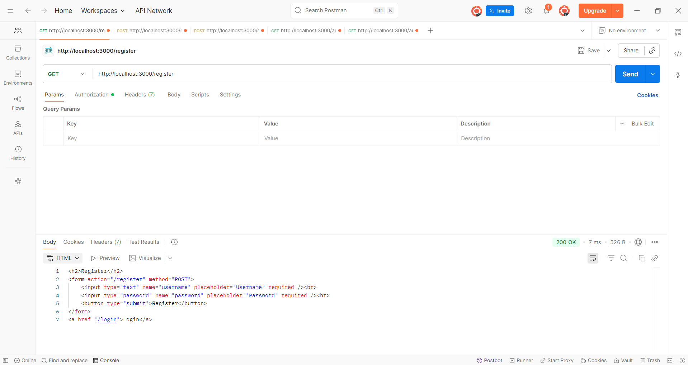
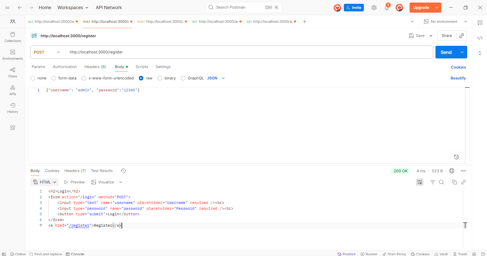
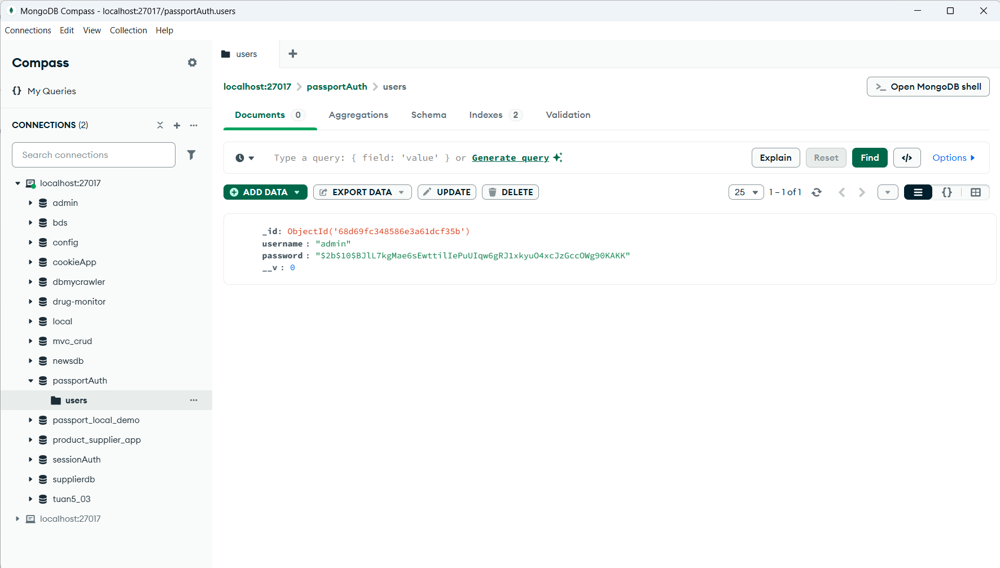
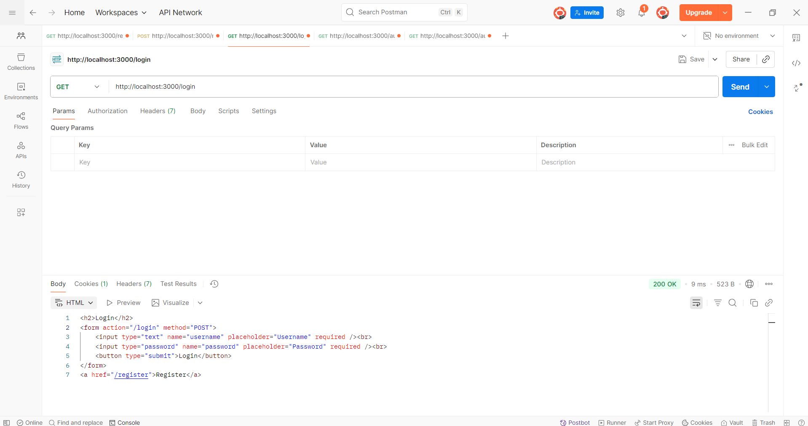
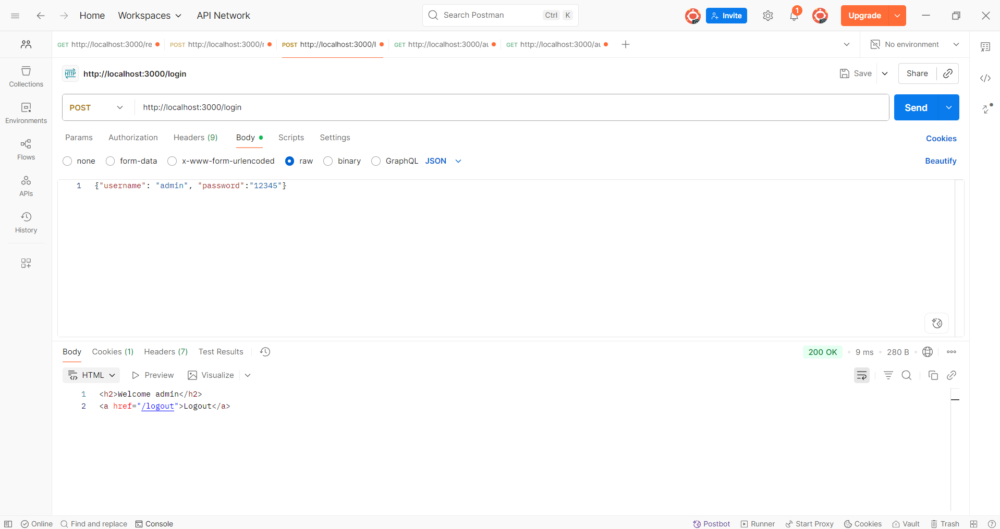
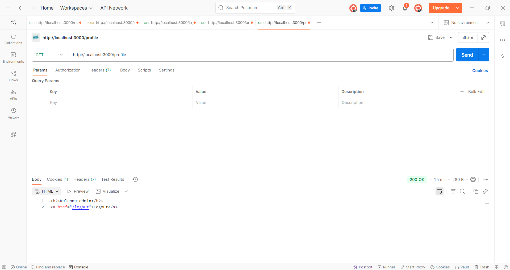
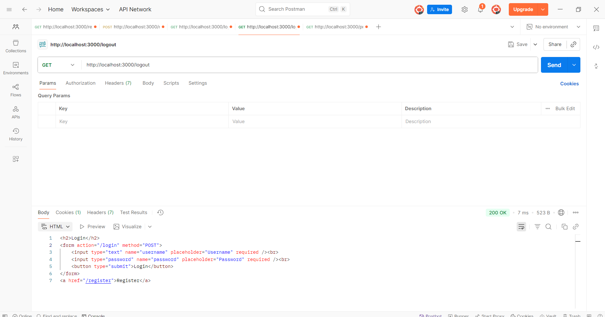
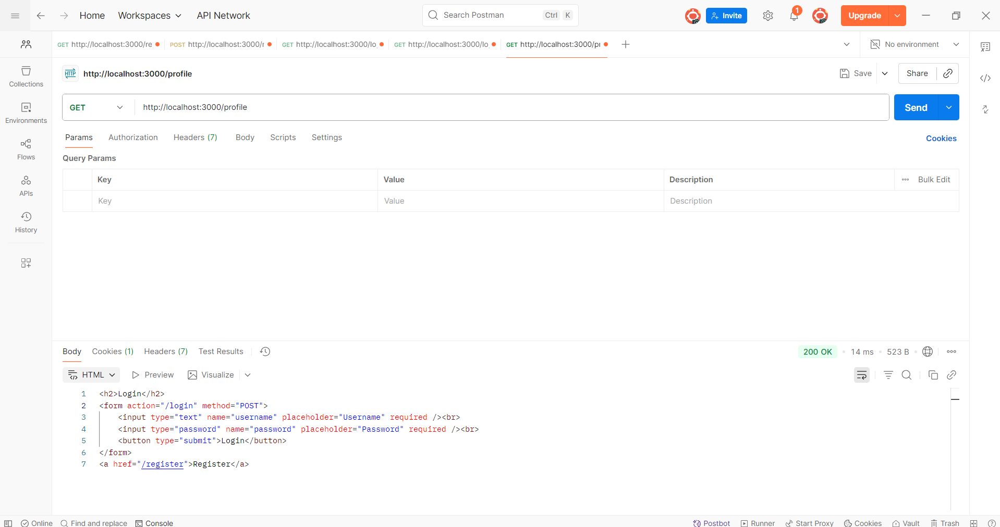

1. khoi chay server

2. Register
- get register truoc khi tao tai khoan: tra ve form dang ky
http://localhost:3000/register

- post register: http://localhost:3000/register
{"username": "admin", "password":"12345"}

-data sau register

3. Login
- get login: tra ve form login

- post login

- router bao ve

4. Logout
-get logout

-router bao ve
